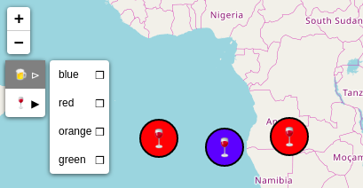
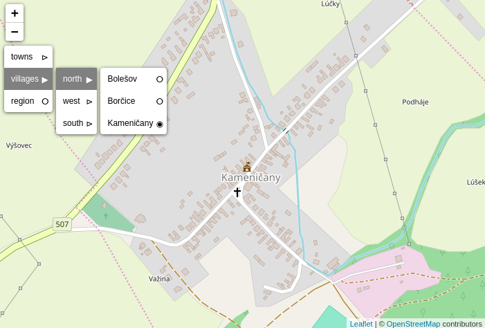
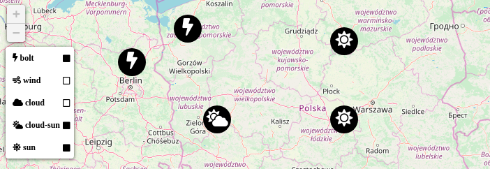

# Leaflet.Control.Select

Plugin for [Leaflet](leaflet.com) library that adds a new control class.

## Motivation

To create a menu-like component that can be implemented as a native leaflet control and control the interaction.

## Demo

See [storybook](https://adammertel.github.io/Leaflet.Control.Select) hosted on github.io

## Screenshots





## How to use

- 1. a) get the npm package `npm i --save leaflet.control.select`
- 1. b) download/clone/fork this repository and use dist folder (you can also build it (see `How to develop`))
- 2. include the original leaflet js and css
- 3. define `L.Control.Select` instance (see options or [example page](https://adammertel.github.io/Leaflet.Control.Select/))

```js
var map = L.map("map", { maxZoom: 14 }).setView([49, 18], 11);
var items = [
  { label: "sunny", value: "☼" },
  { label: "half-sunny", value: "🌤" },
  { label: "half-raining", value: "🌦" },
  { label: "raining", value: "🌨" },
  { label: "tornado", value: "🌪" }
];
L.control
  .select({
    position: "topleft",
    selectedDefault: defaultValue,
    items: items,
    onSelect: function(newItemValue) {
      drawMarker(newItemValue);
    }
  })
  .addTo(map);
```

## How to develop

- `npm install` to get all modules needed for the development
- `npm run build` to create the minified .js code

## Options

### content

#### **items** (default `[]`)

- the content of menu, a collection of objects with **label** and **value** keys (if no labels are provided, values will be used as labels)

simple items example:

```js
    { label: 'option 1', value: 'user-o' },
    { label: 'option 2', value: 'bullhorn' },
    { label: 'option 3', value: 'book' },
    { label: 'option 4', value: 'car' },
    { label: 'option 5', value: 'cog' }
```

nested items example:

```js
[
  {
    label: "group 1",
    value: "g1",
    items: [
      { label: "option 1", value: "g11" },
      { label: "option 2", value: "g12" },
      { label: "option 3", value: "g13" },
      {
        label: "group 3",
        value: "g3",
        items: [
          { label: "option 1", value: "g131" },
          { label: "option 2", value: "g132" },
          { label: "option 3", value: "g133" }
        ]
      }
    ]
  },
  { label: "option 5", value: "g5" },
  {
    label: "group 2",
    value: "g2",
    items: [
      { label: "option 6", value: "g21" },
      { label: "option 7", value: "g22" }
    ]
  }
];
```

#### **multi** (default `false`)

- **true** possible to choose more items at the same time (radio / checkbox mode)

#### **selectedDefault** (default `false`)

- value or list of values to be selected at the initialization

### DOM

#### **id** (default `""`)

- id for the wrapper div element

#### **additionalClass** (default `""`)

- additional class of the wrapper div element

### icons

#### **iconMain** (default `"≡"`)

- icon for the control button

#### **iconChecked** (default `"◉"`)

- icon for checked item

#### **iconUnchecked** (default `"ⵔ"`)

- icon for unchecked item

#### **iconGroupChecked** (default `"▶"`)

- icon for checked group (a group with a checked item)

#### **iconGroupUnchecked** (default `"⊳"`)

- icon for unchecked group (a group without a checked item)

### Events

#### **onOpen()** (default `function(){}`)

- function emmited after the menu is open

#### **onClose()** (default `function(){}`)

- function emmited after the menu is closed

#### **onSelect(item)** (default `function(item){}`)

- function emmited after an item is selected, returns the selected item

#### **onGroupOpen(group item)** (default `function(item){}`)

- function emmited after the group is clicked, returns the group item

## Methods

#### **close()**

- closes the menu


## TODO

- unit tests
- better code documentation
- more methods
