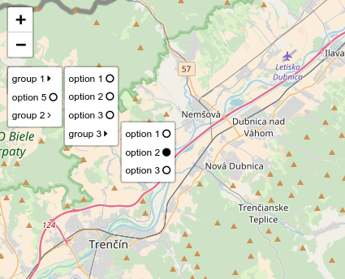

# Leaflet.Control.Select

Plugin for [Leaflet](leaflet.com) library that adds a new control class.


## Motivation

To create a menu-like component that can be implemented as a native leaflet control.

## Demo

[basic example](https://adammertel.github.io/Leaflet.Control.Select/demo/basic.html)
[groups example](https://adammertel.github.io/Leaflet.Control.Select/demo/groups.html)
[multiple example](https://adammertel.github.io/Leaflet.Control.Select/demo/multiple.html)

## How to use

* download the dist folder (or build it by yourself)
* include leaflet.control.select.js and leaflet.control.select.css
* include [font awesome](https://fontawesome.com/)

## How to develop

* npm install --save-dev
* npm start / npm run build

## Options

##### **items** (default [])

the content of menu, a collection of objects with **label** and **value** keys

simple example:

```js
    { label: 'option 1', value: 'user-o' },
    { label: 'option 2', value: 'bullhorn' },
    { label: 'option 3', value: 'book' },
    { label: 'option 4', value: 'car' },
    { label: 'option 5', value: 'cog' }
```

nested example:

```js
[
  {
    label: 'group 1',
    value: 'g1',
    items: [
      { label: 'option 1', value: 'g11' },
      { label: 'option 2', value: 'g12' },
      { label: 'option 3', value: 'g13' },
      {
        label: 'group 3',
        value: 'g3',
        items: [
          { label: 'option 1', value: 'g131' },
          { label: 'option 2', value: 'g132' },
          { label: 'option 3', value: 'g133' }
        ]
      }
    ]
  },
  { label: 'option 5', value: 'g5' },
  {
    label: 'group 2',
    value: 'g2',
    items: [
      { label: 'option 6', value: 'g21' },
      { label: 'option 7', value: 'g22' }
    ]
  }
];
```

##### **multi** (default false)

**true** if it is possible to choose more items at the same time (radio / checkbox mode)

##### **selectedDefault** (default false)

put {value} of item or [{value},..] of more items (multi is true) to make the items selected defaultly

##### **id** (default '')

id of the wrapper div element

##### **additionalClass** (default '')

additional class of the wrapper div element

##### **iconMain** (default 'fa-home')

icon for the control button

##### **iconChecked** (default 'fa-circle')

icon for checked item

##### **iconUnchecked** (default 'fa-circle-o')

icon for unchecked item

##### **iconGroupChecked** (default 'fa-caret-right')

icon for checked group (a group with a checked item)

##### **iconGroupUnchecked** (default 'fa-angle-right')

icon for unchecked group (a group without a checked item)

##### **onOpen()** (default function(){})

function emmited after the menu is open

##### **onClose()** (default function(){})

function emmited after the menu is closed

##### **onSelect(item)** (default function(item){})

function emmited after an item is selected

##### **onGroupOpen(group item)** (default function(item){})

function emmited after the group is clicked, returns the group item

## Methods
